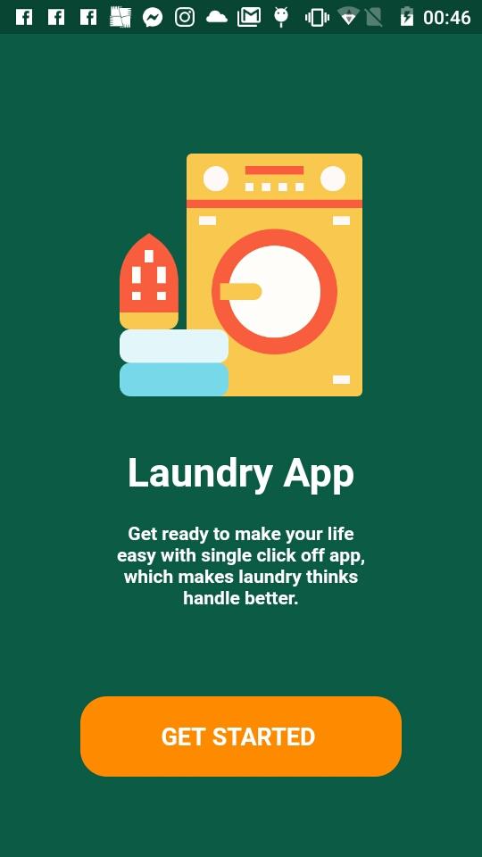
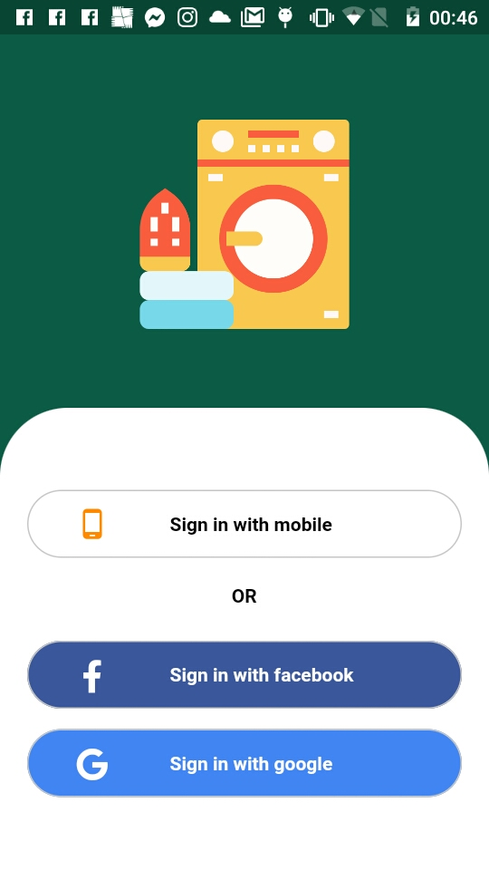

<h1 align="center">
    Clone Dribble Layout 
    
</h1>

## 📔 challenge

The challenge of the project is to create the design in a layout available in Dribble;

## 🚀 Technology

- Flutter

## two first screens

<h1 align="center">
    
    
</h1>

